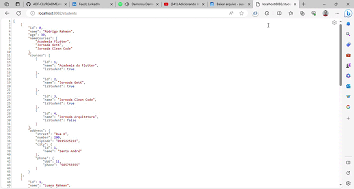
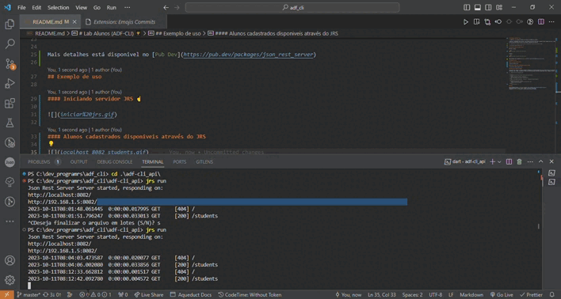

# Lab Alunos (ADF-CLI) 👨‍🎓

> O ADF-CLI é um sistema de cadastro de alunos da Academia do Flutter.

O ADF-CLI é totalmente feito em Dart, com servidor Json Rest Server que é RestFul server baseado em Json. Inicialmente foi utilizado o HTTP mais depois mudou pra o DIO como Get,Post,Put,Delete que são as principais requisicoes de uma API.

## Instalação JRS(Json Rest Server)

Mac OS x & Linux

```sh
dart pub global activate json_rest_server
```

Windows:

```sh
dart pub global activate json_rest_server
```

Mais detalhes está disponivel no [Pub Dev](https://pub.dev/packages/json_rest_server)

## Visão geral do ADF-CLI

### Camadas do projeto

> 📁Models

> 📄 students.dart
> Student é a classe principal do projeto que recebe todas as outras classes como atributos utlizando a herança. Ou seja ela é a classe pai e as outras são as filhas.
> 

> 📄 address.dart
>
> 

> 📄 city.dart
> 📄 courses.dart
> 📄 phone.dart

> 📁Repositories

> 📁Command
>
> > 📁Students
> > 📄students_command.dart
> > 📁SubCommands

📁Bin

#### Iniciando servidor JRS ☝


#### Alunos cadastrados disponiveis através do JRS



#### Encerrando servidor JRS 👇

Use as teclas CTRL+C



### Ambiente de Desenvolvimento

Descrever como instalar e preparar qualquer dependencia de desenvolvimento para seu projeto possa ser executado localmente a pessoas possam contribuir com o mesmo. Se possivel forneça as informações para diferentes plataformas como , Windows, Mac OS, Linux.

<!-- ### Historico de Atualizações

- 0.2.1
  - CHANGE:Atulização dos docs(O codico não foi alterado)
- 0.2.0
  - CHANGE: Removida a função `setPadrao()`
  - ADD: Adicionado nova função `inicializar()`
- 0.1.1
  - FIX: Crash quando executava `escrever()` (Obrigado ao @Cotribuidor)
- 0.1.0
  - o primeiro lançamento estavel
  - CHANGE: Renomeado de `Projeto Curriculo Geek` para
    `Projeto Curriculo Online`
- 0.0.1
  - Projeto Inicial -->

### Meta

Wesley Marques Saraiva - [@Linkedlin](https://www.linkedin.com/in/wesley-marques-saraiva/)
Distribuido sobre a licença. Veja `LICENÇA` para mais informações.
Projeto:[Curriculo Online](https://wesley-saraiva.github.io/#home)
